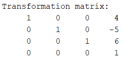
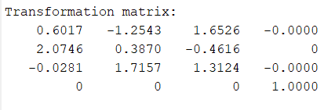
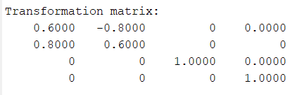
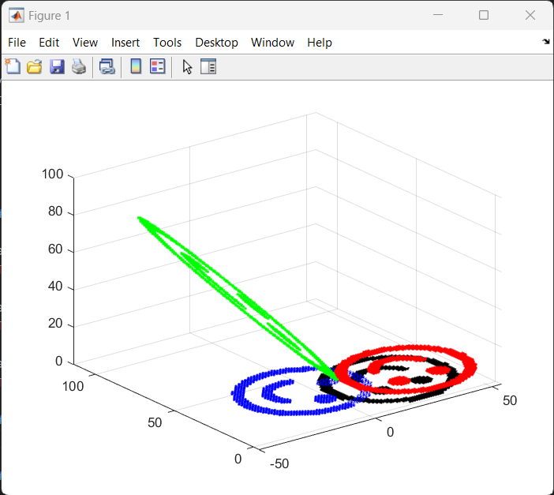
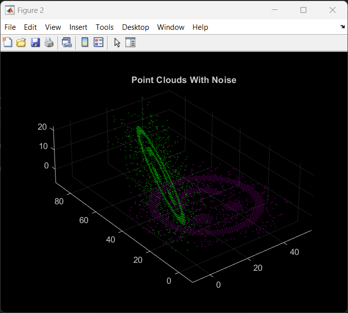
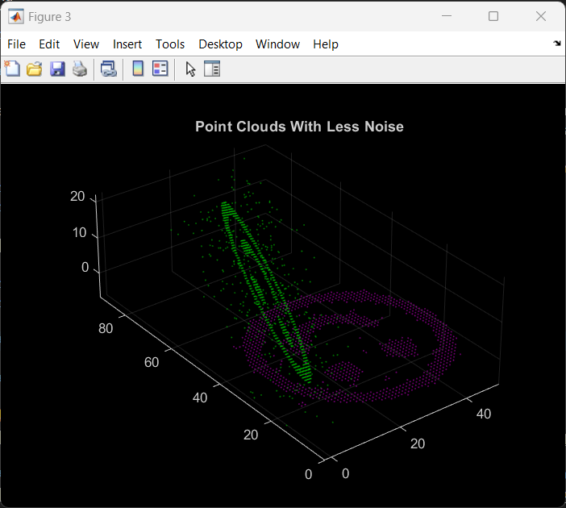
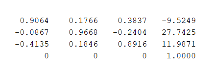
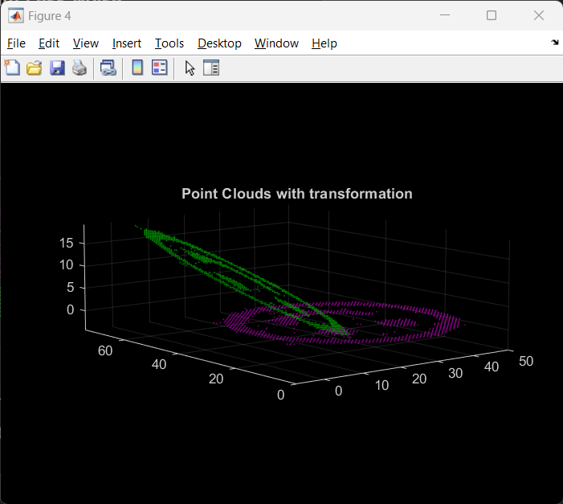

<a name="readme-top"></a>

<!-- PROJECT LOGO -->
<h1 align="center">MM 805 Programing Assignment</h1>

<!-- TABLE OF CONTENTS -->
<details>
  <summary>Table of Contents</summary>
  <ol>
    <li>
      <a href="#prerequisites">Prerequisites</a>
    </li>
    <li>
    <a href="#results">Results</a>
    <ul>
        <li><a href="#transformations">3D Transformations</a></li>
        <li><a href="#experiments">Experiments</a></li>
        <li><a href="#advance">Advance</a></li>
      </ul>
    </li>
  </ol>
</details>


## Prerequisites

- Matlab
- Computer Vision Toolbox

<p align="right">(<a href="#readme-top">back to top</a>)</p>

## Results

### Transformations

#### Transformation Matrix for 1.1


#### Transformation Matrix for 1.2


#### Transformation Matrix for 1.3


#### Utility function to find transformation matrix using computer vision toolbox matlab
```matlab
function [transformationMatrix, status]= findTransformationMatrix(A, B)
    [tformEst, ~, status] = estgeotform3d(A, B,"similarity");
    transformationMatrix = zeros(4,4);
    if (status == 0)
        disp("Transformation matrix:")
        disp(tformEst.A);
        transformationMatrix = tformEst.A;
    elseif (status == 1)
        disp("Inputs do not contain enough points");
    else
        disp("Not enough inliers found");
    end
end
```
<p align="right">(<a href="#readme-top">back to top</a>)</p>

### Experiments

Results after modifying the program. Applied transformation matrices captured earlier and plot the data. <br />
- `Red` dots represents transformed points after applying transformation matrix for 1.1
- `Green` dots represents transformed points after applying transformation matrix for 1.2
- `Blue` dots represents transformed points after applying transformation matrix for 1.3
<br />
<br />



<br />
<br />

#### Updated code
```matlab
im = double (imread('./smile.png'));
[row_im, column_im] = size(im);

figure 
set (gcf, 'Color', [1 1 1])
for x = 1:column_im
    for y = 1:row_im
        if status1 == 0
            temp1 = transformationMatrix1 * [x;y;1;1];
        end
        if status2 == 0
            temp2 = transformationMatrix2 * [x;y;1;1];
        end
        if status3 == 0
            temp3 = transformationMatrix3 * [x;y;1;1];
        end
        if im(y, x) == 255
            plot3(x,y,1,'w.')
            grid on
        else
            plot3(x,y,1,'k.')
            if status1 == 0
                plot3(temp1(1), temp1(2), temp1(3), 'k.', 'Color', 'red');
            end
            if status2 == 0
                plot3(temp2(1), temp2(2), temp2(3), 'k.', 'Color', 'green');
            end
            if status3 == 0
                plot3(temp3(1), temp3(2), temp3(3), 'k.', 'Color', 'blue');
            end
            grid on
        end

        hold on
        drawnow
    end
end
```
<p align="right">(<a href="#readme-top">back to top</a>)</p>

### Advance

- Close to 400 outliers are removed from the noisy data.

#### Positions of points before and after transformation with noisy data


#### Positions of points before and after transformation with reduced noise


#### Code for reducing noice
```matlab
data_A = readFile('A.txt');
data_B = readFile('B.txt');

ptCloud_A = pointCloud(data_A);
ptCloud_B = pointCloud(data_B);

[ptCloud_A, inliersIndices]= pcdenoise(ptCloud_A, "Threshold", 0.01);
ptCloud_B = pointCloud(ptCloud_B.Location(inliersIndices, :));

function [data] = readFile(file_path)
    fileID = fopen(file_path, 'r');
    data = textscan(fileID, '%f %f %f %f');
    fclose(fileID);
    data = cell2mat(data);
    data = data(:,1:3);
end
```

#### Capturing transformation matrix in less noisy data


```matlab
[tform, ~, ~] = pcregistericp(ptCloud_A, ptCloud_B);
```

#### Visualizing transformation in less noisy data
